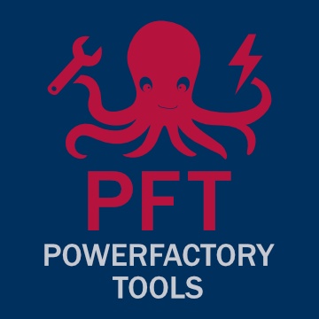

# IEEH PowerFactory Tools

[](https://pypi.python.org/pypi/ieeh-powerfactory-tools)
[](https://opensource.org/licenses/BSD-3-Clause)
[](https://github.com/astral-sh/ruff)
[](https://docs.pydantic.dev/latest/contributing/#badges)

<div align="center">
  
</div>

A toolbox for Python based control and automation of DIgSILENT PowerFactory (> 2022).

  - [ Field of Application](#field-of-application)
    - [Why to Use](#why-to-use)
    - [Provided Functionalities](#provided-functionalities)
  - [ PowerFactory Interface](#powerfactory-interface)
  - [ General Remarks](#general-remarks)
    - [General Unit Conversion](#general-unit-conversion)
    - [Exporter](#exporter)
  - [ Tutorials](#tutorials)
  - [ Installation](#installation)
  - [ Compatibility](#compatibility)
  - [ Development](#development)
  - [ Acknowledgement](#acknowledgement)
  - [ Attribution](#attribution)


## Field of Application

This toolbox is intended for automation of the power flow calculation program [DIgSILENT PowerFactory](https://www.digsilent.de/de/powerfactory.html).
Therefore, the Python-API of PowerFactory, provided by the company, is utilized.
The interaction is recommended via the external usage of PowerFactory ('engine mode'), i.e. PowerFactory is started based on a Python script.

### Why to Use
Read also this comprehensive [blog post](https://medium.com/@Sebastian-DD/automate-powerfactory-with-python-and-powerfactory-tools-e96d33adda74) about the toolbox.

- **Simplify Your Workflow with Type Hints and Autocompletion**

  >Say goodbye to tedious coding and hello to efficient development with our software's type hints and autocompletion features. These tools enable you to write more accurate and readable code, saving you time and reducing the risk of errors.

- **Unlock the Full Potential by Use of our PowerFactory Interface**

  >Are you a PowerFactory user looking to streamline your workflow, reduce errors, and boost productivity? Our toolbox is designed to help you achieve just that. It simplifies the [Python interface of PowerFactory](#powerfactory-interface), allowing you to avoid common pitfalls and errors that other users may encounter.

- **Establish a Standardized Workflow**
  >We make it easier to collaborate with colleagues by providing you a standard *toolbox-way* of doing things in your organization, including a standard way to easily export simulation results e.g. to pandas dataframe or feather. 

- **Get the Most Out of PowerFactory with Our Comfort [Functions](#provided-functionalities)**
  >Take advantage of our reviewed comfort functions, which provide a wide range of benefits, including: simplified grid export, enhanced PowerFactory automation, easy object replacements

- **Get Started with Confidence**

  >We offer helpful [tutorials](#tutorials) to guide you through the learning process, ensuring that you can quickly get up to speed and start achieving your goals.


### Provided functionalities

- **Interface**: collection of comfort functions for the work with the PowerFactory API
- **Exporter**: export of calculation relevant grid data from a PowerFactory project to the [IEEH Power System Data Model (PSDM)](https://github.com/ieeh-tu-dresden/power-system-data-model)
- **Importer**: import from external grid data into the PowerFactory environment [intended in future release]

**Important**: As the set of different elements, data types and attributes can differ between the various main versions (e.g. `2022`, `2024`) of PowerFactory, all functionalities are set up individual for main versions.


## PowerFactory Interface
The toolbox builds up on the [PowerFactoryInterface](./powerfactory_tools/versions/pf2022/interface.py), that provides comfort functions to:
- connect to PowerFactory
- create and alter PowerFactory elements ("physical" elements, "organizational" elements, commands, etc.)
- collect PowerFactory elements of specific types
- execute PowerFactory commands
- ...

## General Remarks

Please find below some important general remarks and assumptions to consider for the application.

### General Unit Conversion

A connection to PowerFactory is established via [PowerFactoryInterface](./powerfactory_tools/versions/pf2022/interface.py).
After this initialization, a **temporary unit conversion to default values is automatically performed** to have a project setting independent behavior. The units are reset when the interface is closed.
During an active connection, the following units apply:

- power in MW
- voltage in kV
- current in kA
- length in km

### Exporter

Read also this comprehensive [blog post](https://medium.com/@Sebastian-DD/export-a-network-from-powerfactory-to-the-power-system-data-model-db46103bdabe) about the exporter.

The [PowerFactoryExporter](./powerfactory_tools/versions/pf2022/exporter/exporter.py) connects to PowerFactory via [PowerFactoryInterface](./powerfactory_tools/versions/pf2022/interface.py).

- The grid export follows the rules of usage recommended by [PSDM](https://github.com/ieeh-tu-dresden/power-system-data-model#-general-remarks):
  - The passive sign convention is used for all types of loads (consumer as well as producer).
  - The `Rated Power` is always defined positive (absolute value).
- By default, all assests of all active grids within the selected study case are to be exported, see [example readme](./examples/README.md).
  - Assets can be excluded by writing `do_not_export` in the first line of the description field.

- The following type of elements are supported so far:
  - `ElmLne` - a symmetrical overhead line / cable
  - `ElmTerm` - a network terminal / bus
  - `ElmCoup` - a bus-bus switch (e.g. a circuit breaker in a detailed switching gear)
  - `ElmTr2` - a symmetrical 2-winding transformers
  - `ElmTr3` - a symmetrical 3-winding transformers (in future releases)
  - `ElmLod` - a general load (asym. / sym.)
  - `ElmLodmv` - a medium voltage load
  - `ElmLodlv` - a low voltage load
  - `ElmLodlvp` - a partial low voltage load
  - `ElmPvsys` - a PV system (generator)
  - `ElmGenstat` - a static generator
  - `ElmXnet` - an external grid representation
  - `RelFuse` - a fuse (bus-bus or bus-load)

- Remarks on export of `loads`:
  - The default load model of general loads (`ElmLod`) is of type `const. impedance`.
  - The default load model of medium-voltage loads (`ElmLodmv`) is of type `const. power`.
  - The default load model of low-voltage loads (`ElmLodlv`, `ElmLodlvp`) is of type `const. current`.
  - Be aware that the reference voltage of the load model must not match the nominal voltage of the terminal the load is connected to.
  - By default, the power factor direction of the rated power is set to "not defined", see docs at [LoadPower:as_rated_power()](./powerfactory_tools/versions/pf2022/exporter/load_power.py).
  - Connected consumer loads with an active and reactive power of zero leads to a RatedPower of `NaN`. Consider to exclude them for export.

- Remarks on export of `transformer`:
  - The impedances of all winding objects are referred to the high voltage side of the transformer.
  - The impedance of transformer earthing is an absolute natural value.
  - The zero sequence impedances are exported without considering the vector group, resulting zero sequence must be calculated separately by the user afterwards.
  - The zero sequence magnetising impedances are dependent on the wiring group, see docs at [PowerFactoryExporter:create_transformer_2w()](./src/powerfactory_tools/versions/pf2024/exporter/exporter.py).

- Remarks on export of `fuses`:
  - Branch like fuses are exported as switching state.
  - Element fuses does not apply a switching state by their own in PowerFactory but considered in export as applicable switching state.

- Remarks on export of the `TopologyCase`:
  - In case that there is an element in the PowerFactory network that cannot be considered/exported by the PowerFactoryExporter according to the current version (e.g. `.ElmVsc`). If this element is connected to an open switch, the error "Topology case does not match specified topology" is thrown within the plausibility check of the export process and the run is terminated. To avoid this, the user has two options:
    - Manual change in PowerFactory: Close the relevant open switch and set the connected element out of service instead.
    - Turn off plausibility check in PowerFactoryExporter: Set the `plausibility_check` parameter of the [PowerFactoryExporter:export()](./src/powerfactory_tools/versions/pf2024/exporter/exporter.py) to `False`.

- Remarks on export of the `SteadyStateCase`:
  - The operating points of the loads are specified by the controller and the associated load model in the topology for active or reactive power, see docs at [PSDM](https://github.com/ieeh-tu-dresden/power-system-data-model?tab=readme-ov-file#-general-remarks).
  - By default a consumer load has a Q-controller of type `CosPhiConst`, except in the case where active and reactive power are explicitly specified in the load flow mask in PowerFactory, then it's `QConst`.
  - It is assumed, that a station controller (if relevant) is exclusively assigned to a single generator.
  The generator itself ought to be parameterized in the same way as the station controller to ensure that the exported operating point of *Q* is the same that set by the station controller.

## Tutorials

Please consider the [README](./examples/README.md) in the example section. Here, Jupyter notebooks are provided to get in touch with the usage of this toolbox:

- for control 
  - basics: [powerfactory_control__basic.ipynb](./examples/powerfactory_control__basic.ipynb)
  - purpose "add loads": [powerfactory_control__add_loads.ipynb](./examples/powerfactory_control__add_loads.ipynb)
- for export to [PSDM](https://github.com/ieeh-tu-dresden/power-system-data-model?tab=readme-ov-file#-general-remarks):
  - [powerfactory_export.ipynb](./examples/powerfactory_export.ipynb)
- for import from [PSDM](https://github.com/ieeh-tu-dresden/power-system-data-model?tab=readme-ov-file#-general-remarks): 
  - [powerfactory_import.ipynb](./examples/powerfactory_import.ipynb)


In addition, please see this interactive example [](https://codeocean.com/capsule/4423034/tree/v1) how to import a PSDM grid representation in `Matlab` for grid calculation purposes.

Also, take a look into our hands-on blog post [Automate PowerFactory with Python and PowerFactory Tools](https://medium.com/@Sebastian-DD/automate-powerfactory-with-python-and-powerfactory-tools-e96d33adda74) to get a better understanding of the toolbox.


## Installation

Install via pip:

```bash
pip install ieeh-powerfactory-tools
```

## Compatibility

| Tools Version | PSDM Version | PowerFactory Version | Recommended Python Version |
|---------------|:------------:|:--------------------:|:--------------:|
| <= 1.3.1      | 1.1.0        | 2022                 | 3.10           |
| 1.4.x         | 1.1.0        | 2022                 | 3.10           |
| 1.5.1         | 1.3.0        | 2022                 | 3.10           |
| 2.1.0         | 2.2.0        | 2022                 | 3.10           |
| 3.0.0         | 2.3.1        | 2022, 2024           | 3.10, 3.12     |
| 3.2.0         | 2.3.3        | 2022, 2024           | 3.10, 3.12     |

**Remark**: As each PowerFactory version may extend features or change the way a model or command is used, powerfactory-tools comes with PowerFactory version-specific code, see [src/versions](./src/powerfactory_tools/versions/).

In Addition, one can easily use PowerFactory main versions (e.g. 2023) which are not yet preimplemented. Just copy a "pf202x" directory within [src/versions](./src/powerfactory_tools/versions/) and adapt the version specific toolbox import paths and powerfactory installation path.

**The correct Python version**: Be aware, that the Python version of your code environment must match the selected Python version of the PowerFactory API!

## Development

[](https://github.com/astral-sh/uv)
[Install uv](https://github.com/astral-sh/uv)


Clone `powerfactory-tools`

```bash
git@github.com:ieeh-tu-dresden/powerfactory-tools.git
```

```bash
cd powerfactory-tools
```

Install `powerfactory-tools` as a production tool

```bash
uv sync --no-dev
```

Install `powerfactory-tools` in development mode

```bash
uv sync
```

Optional: As [pyproject.toml](pyproject.toml) allows different python versions -> specify the Python version (e.g. 3.12) to be used for your local virtual environment `.venv`

```bash
uv sync --python 3.12
```

For development in [Visual Studio Code](https://github.com/microsoft/vscode), all configurations are already provided:

- [ruff](https://github.com/astral-sh/ruff)
- [mypy](https://github.com/python/mypy)


## Acknowledgement

Please note that this work is part of research activities and is still under active development.

This code was tested with `DIgSILENT PowerFactory 2021 SP5` (version < 1.4), `DIgSILENT PowerFactory 2022 SP2` (version < 3.0) and `DIgSILENT PowerFactory 2024 SP2`.

## Attribution

Please provide a link to this repository:

<https://github.com/ieeh-tu-dresden/powerfactory-tools>

Please cite as:

Institute of Electrical Power Systems and High Voltage Engineering - TU Dresden, _PowerFactory Tools - A toolbox for Python based control of DIgSILENT PowerFactory_, Zenodo, 2022. <https://doi.org/10.5281/zenodo.7074968>.

[](https://doi.org/10.5281/zenodo.7074968)
