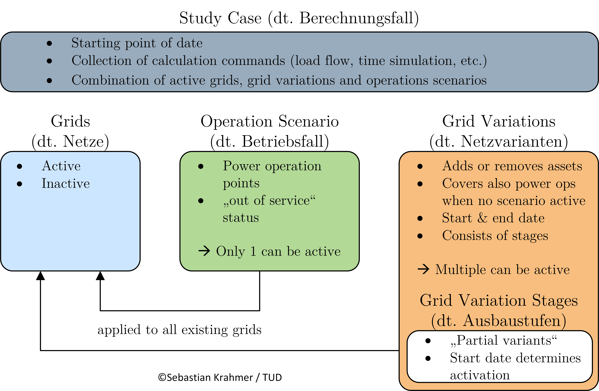
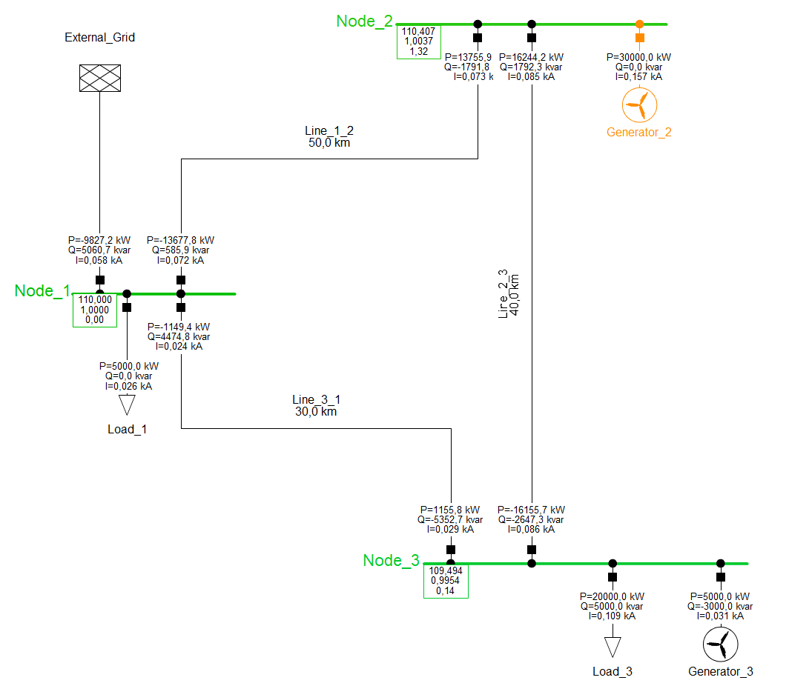
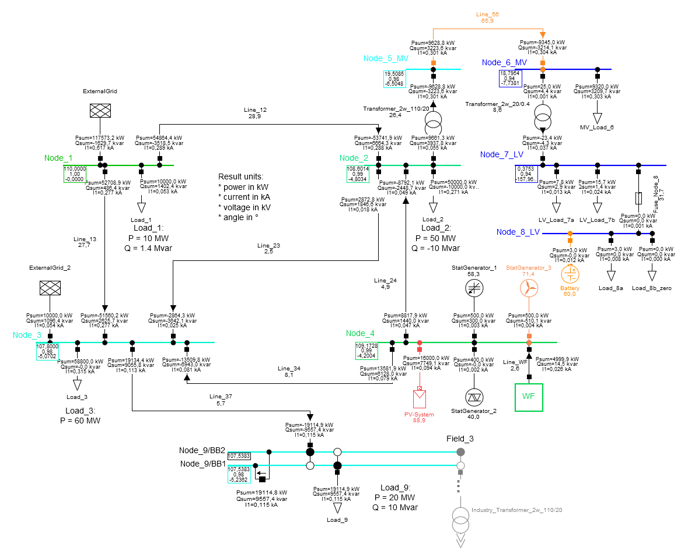
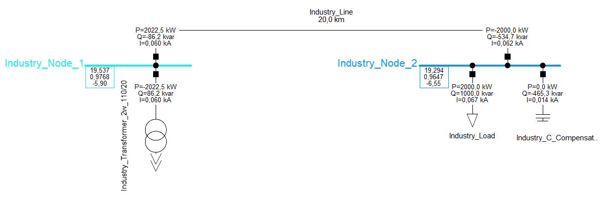

# Application Examples

Examples for application of powerfactory exporter and controller.

- [Export Functionalities](#export-functionalities)
  - [Usage](#usage)
  - [Extended Attributes Export](#extended-attributes-export)
- [Control Functionalities](#control-functionalities)
  - [Non-Interactive Display Mode](#non-interactive-display-mode)
- [Raw PSDM Import](#raw-psdm-import)
- [PowerFactory Example Project](#powerfactory-example-project)

The whole examples are based on the PowerFactory version `2024`, but should also work with `2022`.

## Export Functionalities

The jupyter notebook [powerfactory_export.ipynb](powerfactory_export.ipynb) is provided to get in touch with the usage of the powerfactory exporter.
This example is based on the [PowerFactory example project](#-powerfactory-example-project).

Within the exporter example three different predefined study cases ("Base", "Industry_Park", "Outage") are to be exported.

The exporter provides functions to export

- grid `topology` (raw assets),
- `topology_case` (binary switching info and out of service info) and
- `steadystate_case` (operation points)

to three different json files using the [power system data model (psdm)][link_to_psdm] schema.

### Usage

**Please note**, that default values for the PowerFactory installation path and the Python version are used.
If necessary, one can adapt `powerfactory_path`, `powerfactory_service_pack` and `python_version` when initializing the [PowerFactoryExporter][link_to_exporter].

By default, **all assets of all active grids** within the selected PowerFactory project are to be exported.
- The preferred way for export is to assign the desired study cases to the `export()` function call, see [export example](powerfactory_export.ipynb).
- Alternatively, one can select _study cases_, _operation scenarios_ and _grid variations_ before export for more control, see [control "base" example 7-9](powerfactory_control__base.ipynb).

The following figure provides a short overview of the dependencies within a PowerFactory project.

### Extended Attributes Export

In the case an export of additional attribute data is required for elements of specified types, one can specify a dictionary and pass this as aditional parameter to the `Exporter` class.
In our [export example](powerfactory_export.ipynb) such a request is performed by specifying  the dict `element_specific_attrs`.

## Control Functionalities

### Control Example "Basic"
The jupyter notebook [powerfactory_control__basic.ipynb](powerfactory_control__basic.ipynb) is provided to get in touch with the usage of the basic powerfactory control possibilities.
First the simple grid HV_3_Bus is manipulated, then a more sophisticated control is exceuted at HV_9_Bus grid.

The example includes:

- General request of elements
- Selection of user defined elements (e.g. based on name or voltage level)
- Change of object's attribute values
- Definition of variable monitors and result objects
- Execution of load flow - symmetrical / unsymmetrical
- Preparation and execution of RMS/EMT simulations
- Export of results objects as well as user defined data to json or csv
- Request and change study cases, operation scenarios and network variations

### Control Example "Add Loads"
jupyter notebook [powerfactory_control__add_loads.ipynb](powerfactory_control__add_loads.ipynb) is provided to show how to simply add loads in the grid `3_Bus`.
Here, a grid variant is created first. Then, at all loads except the slack a new load is added with specified characteristics.

### Non-Interactive Display Mode
  As PowerFactory is started in engine mode, the user may want to take a quick look at the PowerFactory application GUI at runtime.
  To do so, insert the following code into your script to open the PF application window in non-interavtive mode. Attention: do not close the window by your own by clicking on the red cross, but process via the user input request.

  See commented code in function `run_three_bus_control_example()` in [powerfactory_import.ipynb](powerfactory_import.ipynb):

    pfi.app.Show()
    time.sleep(5)   # wait for 5 seconds
    input("Press Enter to continue...")  # Wait for user input before proceeding
    pfi.app.Hide()

## Raw PSDM Import

The jupyter notebook [powerfactory_import.ipynb](powerfactory_import.ipynb) is provided to see how to apply a raw import of a given (exported) PSDM grid representation.

Here, `PSDM class objects` are generated out of a given `json`-file.

## PowerFactory Example Project
The related PowerFactory example project `PF2024_PowerFactory-Tools.pfd` is provided in [grids][link_to_example_grids]. 
The project contains:
- 3-bus high voltage grid
- a composition of a 9-bus high voltage grid and a 2-bus medium voltage industry grid

Furthermore, four predefined study cases are provided:

- `3_Bus` (only grid "HV_3_Bus" is active)
- `Base` (only grid "HV_9_Bus" is active)
- `Industry_Park` ("HV_9_Bus" and "MV_2_Bus" are active)
- `Outage` (only grid "HV_9_Bus" is active, additionally the operation case "outOfService_Set1" is applied)

### The 3-bus high voltage grid 'HV_3_Bus'

This very simple example grid contains:

- 110 kV voltage level
- 3 nodes
- 3 branches
- 2 general loads
- 2 static generators
- 1 external grid

### The 9-bus high voltage grid 'HV_9_Bus'

This example grid contains:

- 3 different voltage levels (110 kV, 20 kV, 0.4 kV)
- 9 nodes, including one detailed substation
- 9 branches
- 2 transformers (110/20 adn 20/0.4)
- 5 general loads, including different load models
- 1 MV load
- 2 LV loads
- 1 PV system
- 1 Battery system
- 3 Static generators, including station controller
- 1 compound generator model
- 2 fuses (1 line fuse and 1 element fuse)
- 2 external grids
- 1 optional connection to the MV_2_Bus grid

### The 2-bus medium voltage industry grid 'MV_2_Bus'

This grid is an extension to the 'HV_9_Bus' grid and contains:

- 20 kV voltage level
- 2 nodes
- 1 transformer (110/20) as connection to the HV_9_Bus grid
- 1 branch
- 1 general load (const. power)
- 1 passive asset (capacitor bank)

[link_to_example_grids]: ./grids
[link_to_exporter]: ../powerfactory_tools/versions/pf2024/exporter/exporter.py
[link_to_psdm]: https://github.com/ieeh-tu-dresden/power-system-data-model
