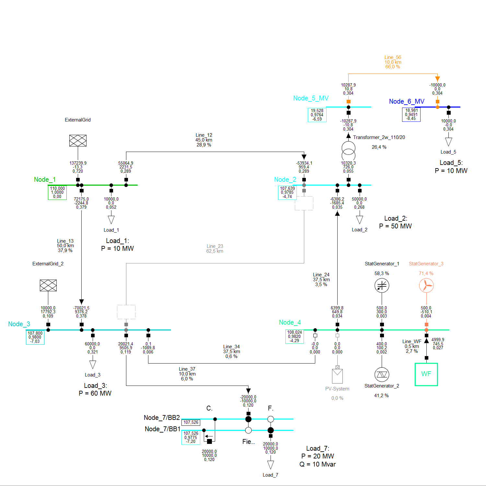

# Examples

Examples for application of powerfactory exporter and controller.

## Example for Usage of Exporter

The jupyter notebook `powerfactory_export.ipynb` is provided to get in touch with the usage of the powerfactory exporter.
This example is based on a 7-bus high voltage grid given in [grids][link_to_example_grids].

The exporter provides functions to export

+ grid `topology`,
+ `topology_case` and
+ `steadystate_case`

to three different json files.
Based on the class arguments of PowerFactoryExporter a DIgSILENT PowerFactory grid is exported to three json files with given schema. The whole grid data is separated into `topology` (raw assets), `topology_case` (binary switching info and out of service info) and `steadystate_case` (operation points).

**Please note** that default values for the installation directory and version number of PowerFactory are used in [interface.py][link_to_interface] which can be adapted by the user using the according parameters.

### The 7-bus high voltage grid 'HV_7_Bus'

This example grid contains:

+ 7 nodes, including one detailed substation
+ 9 branches
+ 5 loads, including different load models
+ 1 PV system and 3 generators, including station controller
+ 1 compound generator model
+ 2 external grids

Further, two different scenarios are available:

+ base
+ OutOfService_Set1

[link_to_example_grids]: ./grids
[link_to_interface]: ../powerfactory_utils/interface.py
