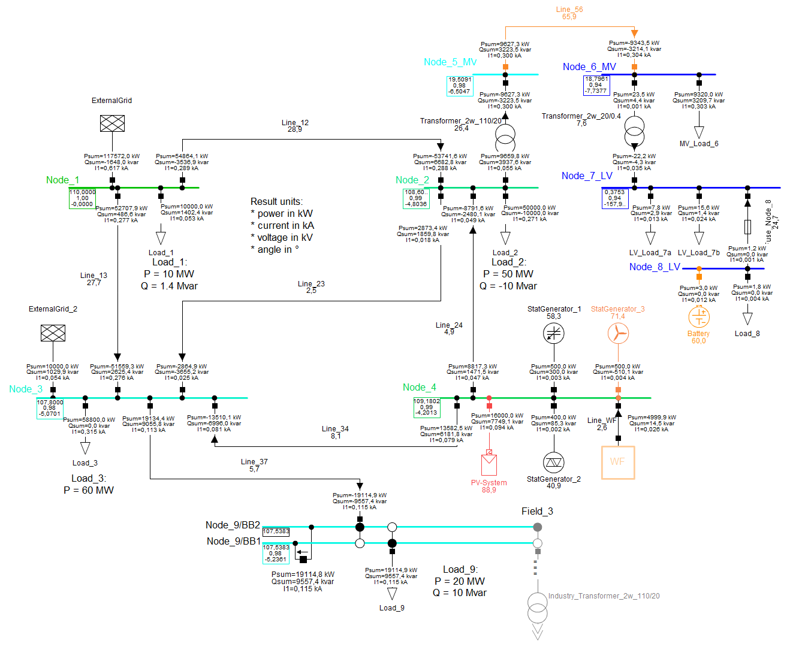

# Examples

Examples for application of powerfactory exporter and controller.

## Example for the Usage of the Exporter

The jupyter notebook [powerfactory_export.ipynb](powerfactory_export.ipynb) is provided to get in touch with the usage of the powerfactory exporter.
This example is based on a 9-bus high voltage grid given in [grids][link_to_example_grids].

The exporter provides functions to export

+ grid `topology`,
+ `topology_case` and
+ `steadystate_case`

to three different json files.
Based on the class arguments of PowerFactoryExporter a DIgSILENT PowerFactory grid is exported to three json files with given schema. The whole grid data is separated into `topology` (raw assets), `topology_case` (binary switching info and out of service info) and `steadystate_case` (operation points).

### Usage

**Please note** that default values for the installation directory and version number of PowerFactory are used.
The user can adapt `powerfactory_path` and `powerfactory_version` when initialazing the [PowerFactoryInterface][link_to_interface].

By default, **all assests of all active grids** within the selected PowerFactory project are to be exported.
For more control, the user can select _study cases_, _operation scenarios_ and _grid variations_ before export, see [control example 5](powerfactory_control.ipynb).
The following figure provides a short overview of the dependencies within a PowerFactory project.

## Example for the Usage of the Control Functionalities

The jupyter notebook [powerfactory_control.ipynb](powerfactory_control.ipynb) is provided to get in touch with the usage of the powerfactory control possibilities.
This example is based on a 9-bus high voltage grid given in [grids][link_to_example_grids].

The example includes:

+ General request of elements
+ Selection of user defined elements (e.g. based on name or voltage level)
+ Change of object's attribute values
+ Run load flow - symmetrical / unsymmetrical
+ Export of user defined data to json
+ Request and change study cases, operation scenarios and network variations

## The 9-bus high voltage grid 'HV_9_Bus'

This example grid contains:

+ 3 different voltage levels (110 kV, 20 kV, 0.4 kV)
+ 9 nodes, including one detailed substation
+ 9 branches
+ 2 transformers
+ 5 general loads, including different load models
+ 1 MV load
+ 2 LV loads
+ 1 PV system
+ 1 Battery system
+ 3 Static generators, including station controller
+ 1 compound generator model
+ 2 external grids
+ 2 fuses (1 line fuse and 1 element fuse)

Further, two different scenarios are available:

+ base
+ outOfService_Set1

[link_to_example_grids]: ./grids
[link_to_interface]: ../powerfactory_tools/interface.py
