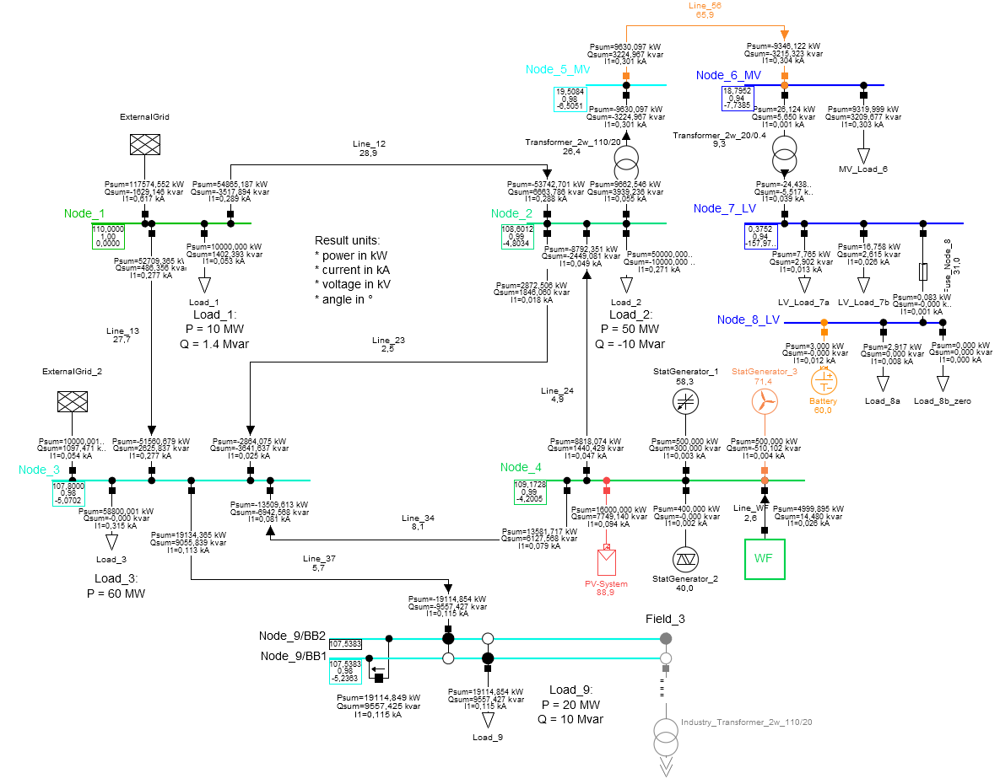

# Application Examples

Examples for application of powerfactory exporter and controller.

- [Application Examples](#application-examples)
  - [Export Functionalities](#export-functionalities)
  - [Control Functionalities](#control-functionalities)
  - [Raw PSDM Import](#import-functionalities)
  - [PowerFactory Example Project](#-powerfactory-example-project)

## 
 Export Functionalities

The jupyter notebook [powerfactory_export.ipynb](powerfactory_export.ipynb) is provided to get in touch with the usage of the powerfactory exporter.
This example is based on the [PowerFactory example project](#-powerfactory-example-project).

Within the exporter example three different predefined study cases ("Base", "Industry_Park", "Outage") are to be exported.

The exporter provides functions to export

- grid `topology` (raw assets),
- `topology_case` (binary switching info and out of service info) and
- `steadystate_case` (operation points)

to three different json files using the [power system data model (psdm)][link_to_psdm] schema.

### Usage

**Please note** that default values for the installation directory and version number of PowerFactory are used.
The user can adapt `powerfactory_path` and `powerfactory_version` when initializing the [PowerFactoryInterface][link_to_interface].

By default, **all assests of all active grids** within the selected PowerFactory project are to be exported.
- The preferred way for export is to first define study cases in PowerFactory und then assign the desired study cases to the `export()` function call, see [export example](powerfactory_export.ipynb).
- For more control, the user can select _study cases_, _operation scenarios_ and _grid variations_ before export, see [control example 7-9](powerfactory_control.ipynb).

The following figure provides a short overview of the dependencies within a PowerFactory project.

## 
 Control Functionalities

The jupyter notebook [powerfactory_control.ipynb](powerfactory_control.ipynb) is provided to get in touch with the usage of the powerfactory control possibilities.

The example includes:

- General request of elements
- Selection of user defined elements (e.g. based on name or voltage level)
- Change of object's attribute values
- Definition of variable monitors and result objects
- Execution of load flow - symmetrical / unsymmetrical
- Preparation and execution of RMS/EMT simulations
- Export of results objects as well as user defined data to json or csv
- Request and change study cases, operation scenarios and network variations

## 
 Raw PSDM Import

The jupyter notebook [powerfactory_import.ipynb](powerfactory_import.ipynb) is provided to how to apply a raw import of a given (exported) PSDM grid representation.

Here, `PSDM class objects` are generated out of a given `json`-file.

## 
 PowerFactory Example Project
The related PowerFactory example project `PF2022_PowerFactory-Tools.pfd` is provided in [grids][link_to_example_grids]. 
The project contains:
- 3-bus high voltage grid
- a composition of a 9-bus high voltage grid and a 2-bus medium voltage industry grid

Furthermore, four predefined study cases are provided:

- `3_Bus` (only grid "HV_3_Bus" is active)
- `Base` (only grid "HV_9_Bus" is active)
- `Industry_Park` ("HV_9_Bus" and "MV_2_Bus" are active)
- `Outage` (only grid "HV_9_Bus" is active, additionally the operation case "outOfService_Set1" is applied)

### The 3-bus high voltage grid 'HV_3_Bus'

This very simple example grid contains:

- 110 kV voltage level
- 3 nodes
- 3 branches
- 2 general loads
- 2 static generators
- 1 external grid

### The 9-bus high voltage grid 'HV_9_Bus'

This example grid contains:

- 3 different voltage levels (110 kV, 20 kV, 0.4 kV)
- 9 nodes, including one detailed substation
- 9 branches
- 2 transformers (110/20 adn 20/0.4)
- 5 general loads, including different load models
- 1 MV load
- 2 LV loads
- 1 PV system
- 1 Battery system
- 3 Static generators, including station controller
- 1 compound generator model
- 2 fuses (1 line fuse and 1 element fuse)
- 2 external grids
- 1 optional connection to the MV_2_Bus grid

### The 2-bus medium voltage industry grid 'MV_2_Bus'

This grid is an extension to the 'HV_9_Bus' grid and contains:

- 20 kV voltage level
- 2 nodes
- 1 transformer (110/20) as connection to the HV_9_Bus grid
- 1 branch
- 1 general load (const. power)
- 1 passive asset (capacitor bank)

[link_to_example_grids]: ./grids
[link_to_interface]: ../powerfactory_tools/interface.py
[link_to_psdm]: https://github.com/ieeh-tu-dresden/power-system-data-model
